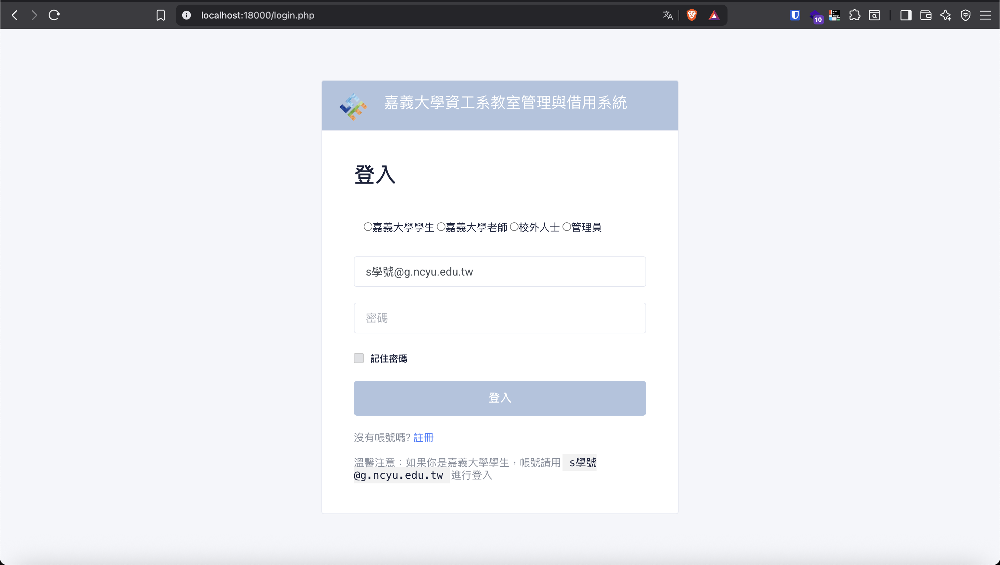
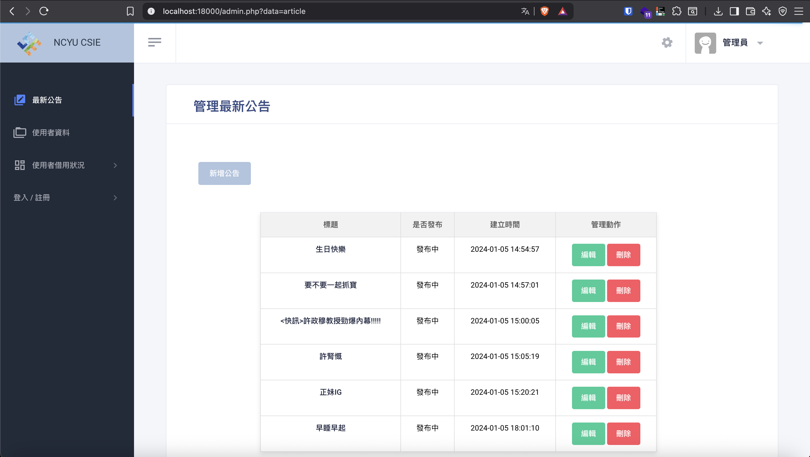
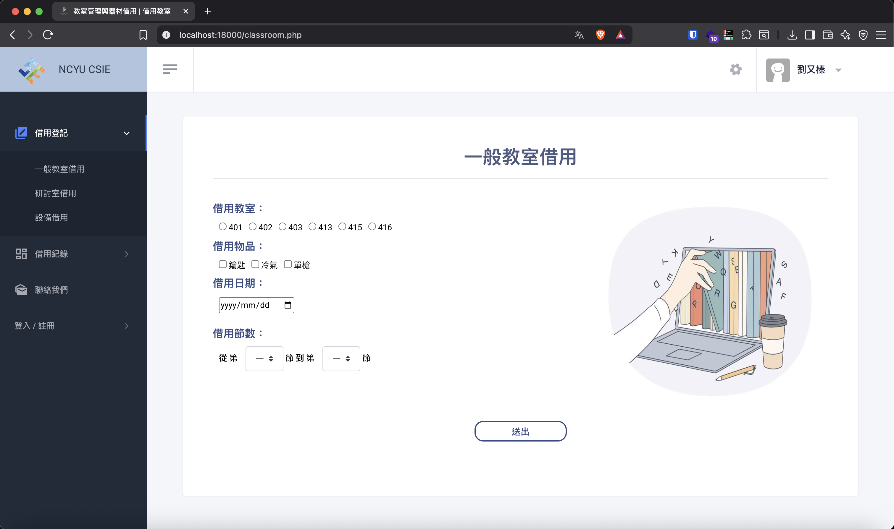
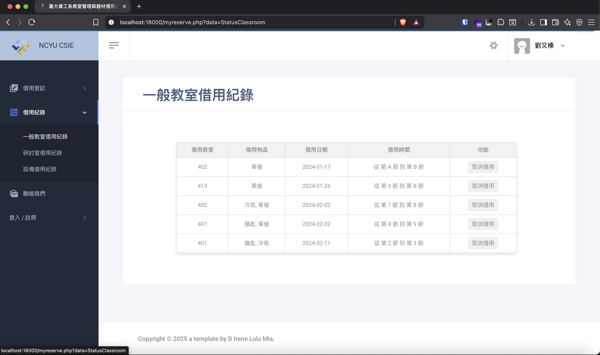
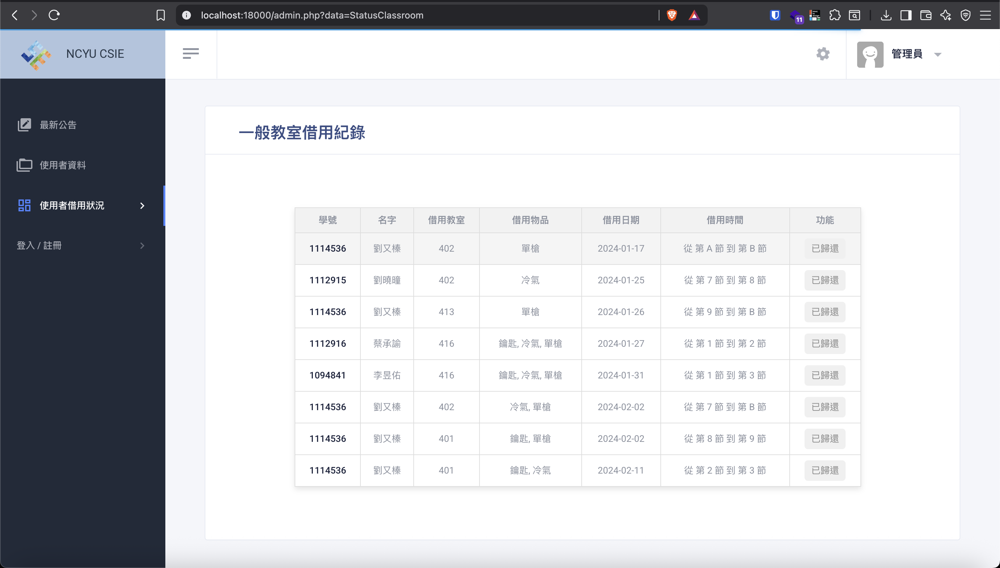

# 嘉大資工系教室管理與器材借用管理系統

本專題以 PHP 與 MySQL 為核心技術，建立資料庫設計與網站實作一個系上的教室與器材借用的管理系統。透過 MySQL 建立使用者、教室與器材的關聯式資料表，並以 PHP 負責使用者驗證、表單處理與資料庫互動，實現動態查詢與管理。此系統取代傳統紙本登記，提供精簡的介面，使系辦提升管理效率與方便性。

## 頁面

### 登入頁面
  
### 最新公告頁面
  
### 借用紀錄頁面 (使用者)
  
  
### 借用紀錄頁面（管理者）
  
